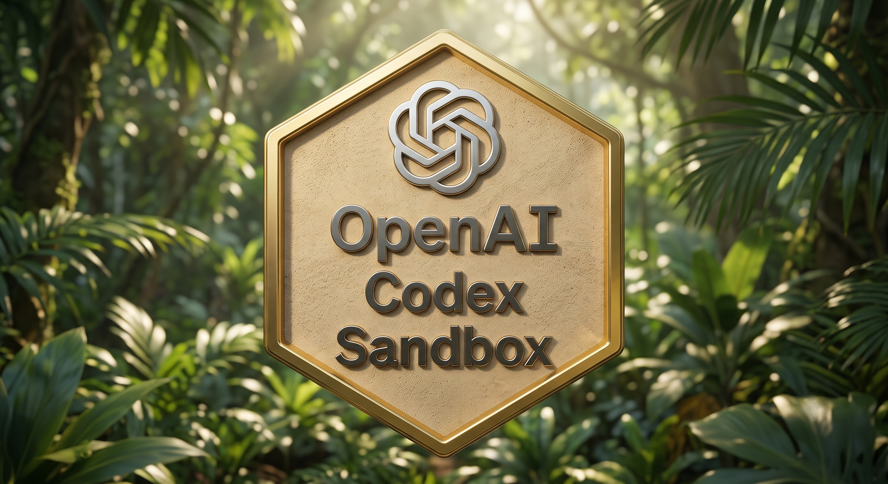

<p align="center">
  
</p>

<h1 align="center">codex-sandbox</h1>

<p align="center">
  <a href="https://github.com/phrenolt/codex-sandbox/actions/workflows/ci.yml"></a>
  <a href="https://github.com/phrenolt/codex-sandbox/actions/workflows/build.yml"></a>
</p>

<p align="center">
  <a href="https://www.patreon.com/phrenolt"></a>
</p>

A secure, isolated container environment for the OpenAI Codex CLI.

This project wraps Codex in a rootless Podman container to ensure it only has access to the specific project directory you are working on. This protects your host system and `$HOME` directory from accidental or malicious modifications.

## Quickstart

### 0. Clone (with submodules)
This repo vendors its shared shell logic from [`agents-sandbox-common`](https://github.com/phrenolt/agents-sandbox-common) as a git submodule at `common/`. Clone with submodules so it comes along:

```bash
git clone --recurse-submodules https://github.com/phrenolt/codex-sandbox.git
# already cloned without it? pull the submodule in:
git submodule update --init
```

### 1. Install & Build
Run the installation script to build the sandbox image and add the helper commands to your shell configuration (`~/.bashrc` or `~/.zshrc`):

```bash
./install.sh
source ~/.bashrc  # or ~/.zshrc
```

### 2. Run Codex
To start a Codex session in your current directory, simply run:

```bash
codex-sandbox
```

You can also launch it for a specific directory or pass additional arguments directly:

```bash
codex-sandbox /path/to/your/project
codex-sandbox /path/to/your/project --prompt "refactor main.py"
```

## Available Commands

- `codex-sandbox [dir] [args]` — Launch the Codex CLI for a specific project.
- `codex-sandbox-sh [dir]` — Open an interactive bash shell inside the container to inspect the environment.
- `codex-sandbox-prompt "<prompt>"` — Run a single Codex prompt in the container without mounting any project directory.
  - *Example with model selection:* `codex-sandbox-prompt -m gpt-5.5 --prompt "write a hello world script"`
- `codex-sandbox-update` — Rebuild the sandbox image from the source directory and update the pinned image ID.

## Features

- **Strict Isolation**: Only your selected project directory is mounted to `/work` in the container.
- **Safe Persistence**: Codex configuration and authentication tokens are persisted securely in `~/.local/share/codex-sandbox` rather than your real home directory.
- **Built-in Tooling**: The container image comes pre-equipped with `git`, `python3`, `npm`, and `nodejs` so Codex can effectively analyze and run your code.
- **Secure by Default**: Explicitly refuses to mount your host's root or `$HOME` directories, and drops all container capabilities (`--cap-drop=ALL`). Uses image ID pinning to prevent accidental or malicious image spoofing.
